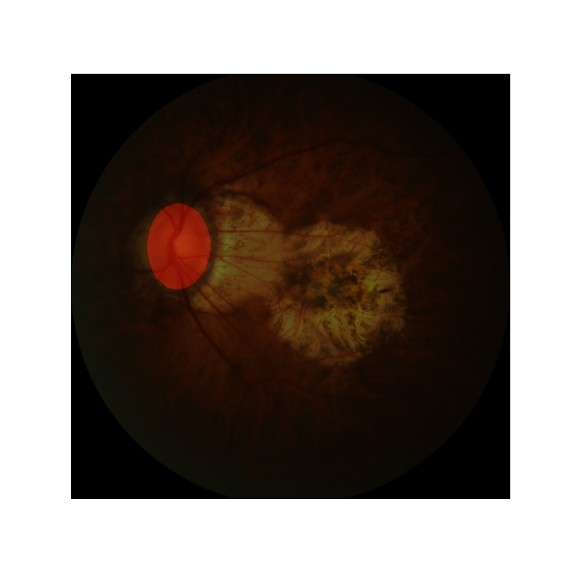

# Evaluation of different segmentation models on a optic nerve dataset

## Data overview

Optical nerve image and its mask

## Results

Unet results after 50 epochs (left). mobilenet_v2 pretrained with imagenet as encoders (right).
